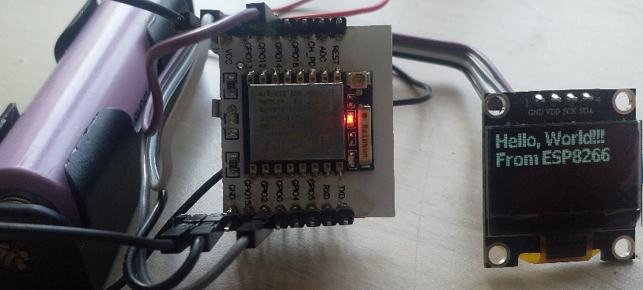

# ESP8266 SSD1306 OLED display server

This project implements simple REST API for controlling OLSED display with SSD1306 compatible controller (aka Arduino dispaly) and minimalistic WEB UI.

# Features
- Write text on the display using HTTP request.
- Unicode text is supported
- 2 fonts are available: monospace 5x8 - ASCII + Russian, variable width 11x16 - ASCII only.
- Clear screan.
- Positive and 
- Draw an imagge on the display using HTTP request.
- Simple WEB compatible sending text and drawig images.

# Buld
This project is based on ESP8266_RTOS_SDK v3.3.
THE SDK's build system is used to build this project. Follow the instructions at https://github.com/espressif/ESP8266_RTOS_SDK/blob/release/v3.3/README.md.

# TODO
- Use POST method for transfering text to display. ESP8266 capable of handing only less than 500 bytes in ULR params, this is less then 100 encoded Unicode symbols.
- Add templates to periodically fetch, parse and display data from remote sources.
- support for mobile devices.
- re-design WEB UI.